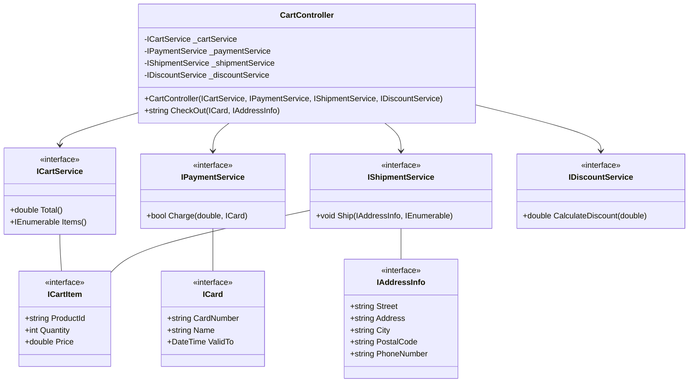

# Class Diagram for EcommerceApp.Api

```mermaid
classDiagram
    class CartController {
        -ICartService _cartService
        -IPaymentService _paymentService
        -IShipmentService _shipmentService
        -IDiscountService _discountService
        +CartController(ICartService, IPaymentService, IShipmentService, IDiscountService)
        +string CheckOut(ICard, IAddressInfo)
    }
    
    class ICartService {
        <<interface>>
        +double Total()
        +IEnumerable<ICartItem> Items()
    }
    
    class IPaymentService {
        <<interface>>
        +bool Charge(double, ICard)
    }
    
    class IShipmentService {
        <<interface>>
        +void Ship(IAddressInfo, IEnumerable<ICartItem>)
    }
    
    class IDiscountService {
        <<interface>>
        +double CalculateDiscount(double)
    }
    
    class ICartItem {
        <<interface>>
        +string ProductId
        +int Quantity
        +double Price
    }
    
    class ICard {
        <<interface>>
        +string CardNumber
        +string Name
        +DateTime ValidTo
    }
    
    class IAddressInfo {
        <<interface>>
        +string Street
        +string Address
        +string City
        +string PostalCode
        +string PhoneNumber
    }
    
    CartController --> ICartService
    CartController --> IPaymentService
    CartController --> IShipmentService
    CartController --> IDiscountService
    ICartService -- ICartItem
    IPaymentService -- ICard
    IShipmentService -- IAddressInfo
    IShipmentService -- ICartItem
```
